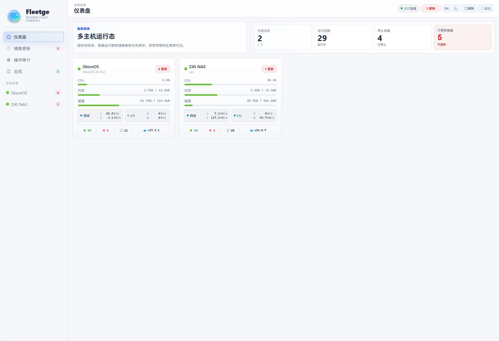
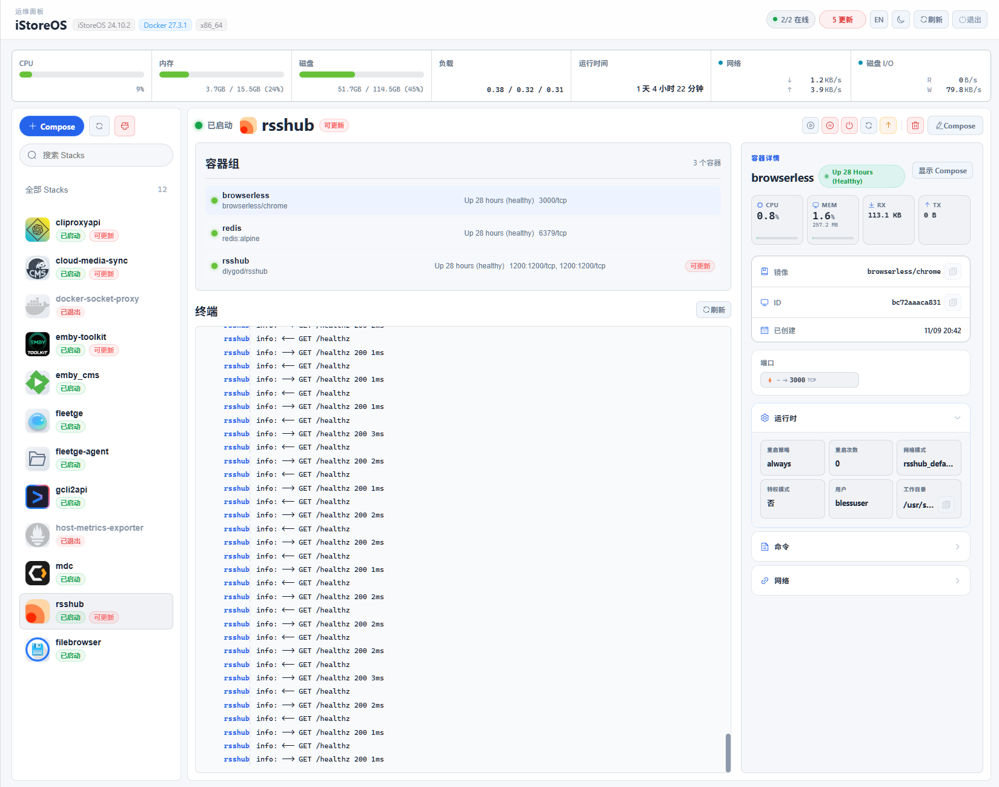
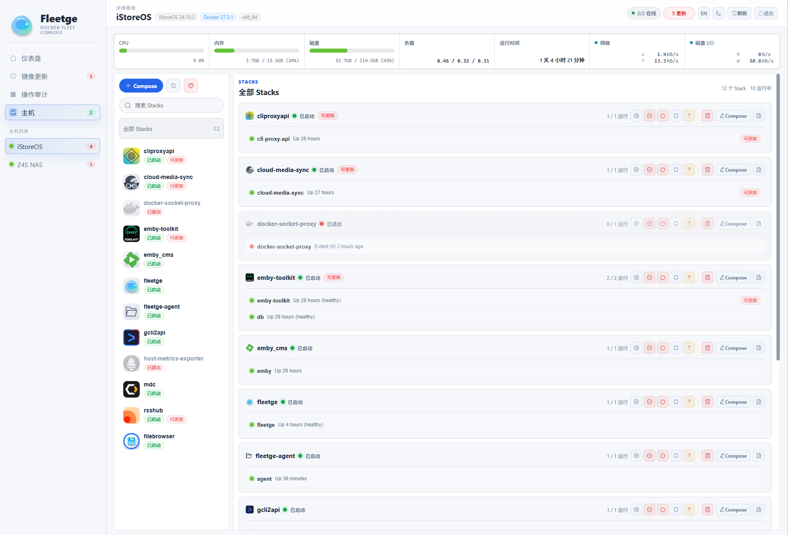
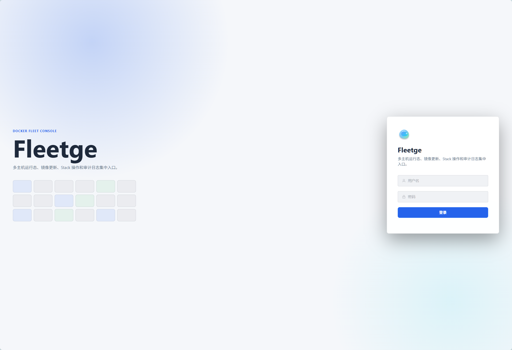

<div align="center">

# 🚢 Fleetge - Docker Fleet Console

**A lightweight, real-time multi-host Docker fleet and Compose Stack management console.**

[English](#english-version) | [简体中文](#简体中文版本)

</div>

---

<div align="center">
  
  <br/>
  <em>Modern and intuitive multi-host overview dashboard</em>
</div>

---

## 简体中文版本

多主机 Docker 容器集群及 Compose Stack 统一运维控制台。

Fleetge 聚合了 `Dockge` / `fleetge-agent`、`docker-socket-proxy` 以及 `host-metrics` 数据源，在单容器内为您提供高效、低消耗的多主机状态只读监控、Compose Stack 生命周期管理、实时资源大盘以及详细操作审计流水。

### ✨ 核心特性 / Features

<table>
  <tr>
    <td width="50%" valign="top">
      <h4>🔍 主机与容器大盘监控</h4>
      <p>实时在线探测与资源监控，展示 CPU、内存、磁盘 IO、网络流速及容器运行数等关键指标。支持秒级实时历史曲线。</p>
      
    </td>
    <td width="50%" valign="top">
      <h4>📦 Compose Stack 生命周期管理</h4>
      <p>统一的多节点环境 Stack 列表，支持一键启动、停止、重启、更新与删除。提供容器的 SSE 实时终端输出，操作无缝流转。</p>
      
    </td>
  </tr>
  <tr>
    <td width="50%" valign="top">
      <h4>➕ 快速编排 Compose</h4>
      <p>提供直观易用的全新 Compose Stack 编写界面，支持语法高亮，轻松编排您的容器。</p>
      
    </td>
    <td width="50%" valign="top">
      <h4>🛡️ 安全认证与登录审计</h4>
      <p>所有凭证进行高级别（Fernet）安全落库。所有关键写操作（清理、Stack 动作）均计入审计日志，确保操作轨迹可追踪。</p>
      
    </td>
  </tr>
</table>

### 🚀 快速开始与部署

#### 1. 密钥准备
在部署控制台前，您需要生成必要的加密密钥：
```bash
# 生成 JWT 签名密钥
python -c "import secrets; print(secrets.token_hex(32))"

# 生成远端密码解密密钥
python -c "from cryptography.fernet import Fernet; print(Fernet.generate_key().decode())"

# 生成管理员登录密码的 Argon2 Hash
pip install pwdlib[argon2]
python -c "from pwdlib import PasswordHash; print(PasswordHash.recommended().hash('your-admin-password'))"
```

#### 2. 配置文件
复制 `.env.example` 并填入密钥：
```bash
cp .env.example .env
```
*(注意：`ADMIN_PASSWORD_HASH` 在 `.env` 中必须使用单引号包裹，避免变量插值解析错误。)*

创建主机列表：
```bash
cp hosts.yaml.example data/hosts.yaml
```

**受管主机模式推荐（Fleetge Agent 模式）**
只需在被监控节点运行轻量级 `fleetge-agent`：
```yaml
services:
  agent:
    image: ghcr.io/virgoooox/fleetge-agent:latest
    container_name: fleetge-agent
    restart: unless-stopped
    ports:
      - "8080:8080"
    environment:
      - AGENT_TOKEN=your_agent_secret_token
      - STACKS_BASE_DIR=/opt/stacks
      - DISK_PATHS=/
      - COLLECT_INTERVAL=5
    volumes:
      - /var/run/docker.sock:/var/run/docker.sock
      - /opt/stacks:/opt/stacks
```

#### 3. 启动控制台
```bash
docker compose up -d
```
启动后在浏览器访问 `http://<ip>:80` 即可登入。

---

## English Version

A centralized multi-host Docker fleet and Compose Stack management console.

Fleetge aggregates data from `Dockge` / `fleetge-agent`, `docker-socket-proxy`, and `host-metrics` to provide a unified, low-overhead dashboard for real-time monitoring, Compose Stack lifecycle control, resource tracking, and operational audit logs.

### ✨ Core Features

<table>
  <tr>
    <td width="50%" valign="top">
      <h4>🔍 Host & Container Monitoring</h4>
      <p>Real-time metrics for CPU, Memory, Disk I/O, Network traffic, and active containers with 1-second interval historical charts.</p>
      
    </td>
    <td width="50%" valign="top">
      <h4>📦 Stack Lifecycle Management</h4>
      <p>Centralized view for multiple environments. Start, stop, restart, update, and remove Compose Stacks with live SSE terminal logs.</p>
      
    </td>
  </tr>
  <tr>
    <td width="50%" valign="top">
      <h4>➕ Compose Editor</h4>
      <p>Intuitive built-in text editor with syntax highlighting for effortlessly writing and deploying new Compose Stacks.</p>
      
    </td>
    <td width="50%" valign="top">
      <h4>🛡️ Secure Access & Audit</h4>
      <p>Enterprise-grade Fernet encryption for stored credentials. Comprehensive audit logs to track stack actions and system commands.</p>
      
    </td>
  </tr>
</table>

### 🚀 Quick Start & Deployment

#### 1. Generate Encryption Keys
Before starting, generate the required security keys:
```bash
# Generate JWT Secret
python -c "import secrets; print(secrets.token_hex(32))"

# Generate Fernet key for database credentials
python -c "from cryptography.fernet import Fernet; print(Fernet.generate_key().decode())"

# Generate Argon2 password hash for the admin account
pip install pwdlib[argon2]
python -c "from pwdlib import PasswordHash; print(PasswordHash.recommended().hash('your-admin-password'))"
```

#### 2. Configuration
Copy the `.env.example` and paste your generated keys:
```bash
cp .env.example .env
```
*(Note: Be sure to wrap the `ADMIN_PASSWORD_HASH` value in single quotes inside the `.env` file!)*

Configure your host nodes:
```bash
cp hosts.yaml.example data/hosts.yaml
```

**Recommended Host Setup (Fleetge Agent)**
Deploy the lightweight agent on your remote machines:
```yaml
services:
  agent:
    image: ghcr.io/virgoooox/fleetge-agent:latest
    container_name: fleetge-agent
    restart: unless-stopped
    ports:
      - "8080:8080"
    environment:
      - AGENT_TOKEN=your_agent_secret_token
      - STACKS_BASE_DIR=/opt/stacks
      - DISK_PATHS=/
      - COLLECT_INTERVAL=5
    volumes:
      - /var/run/docker.sock:/var/run/docker.sock
      - /opt/stacks:/opt/stacks
```

#### 3. Launch the Console
```bash
docker compose up -d
```
Access the dashboard via `http://<ip>:80`.

---

<div align="center">
  <p>Released under the MIT License.</p>
</div>
