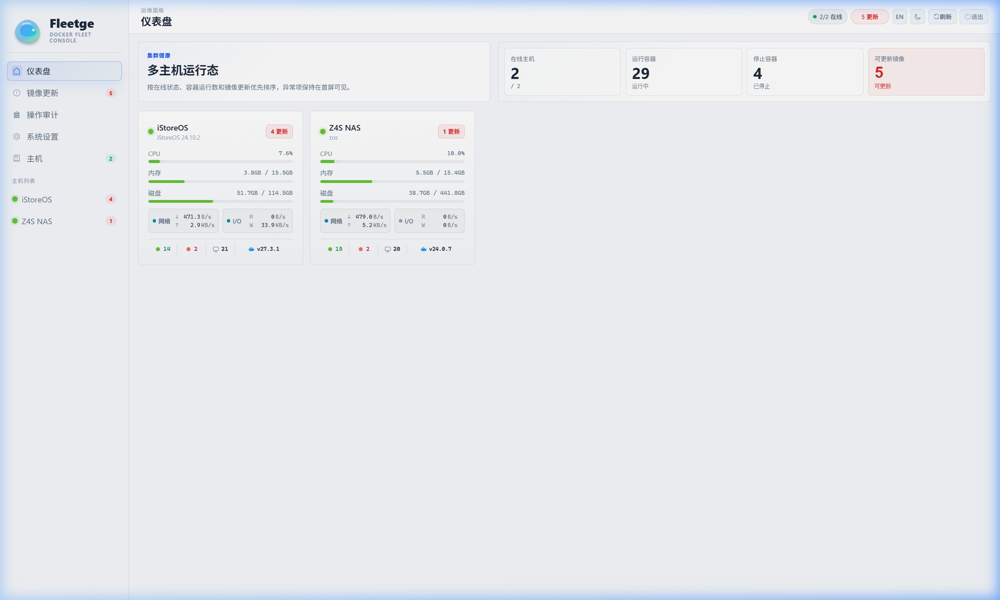
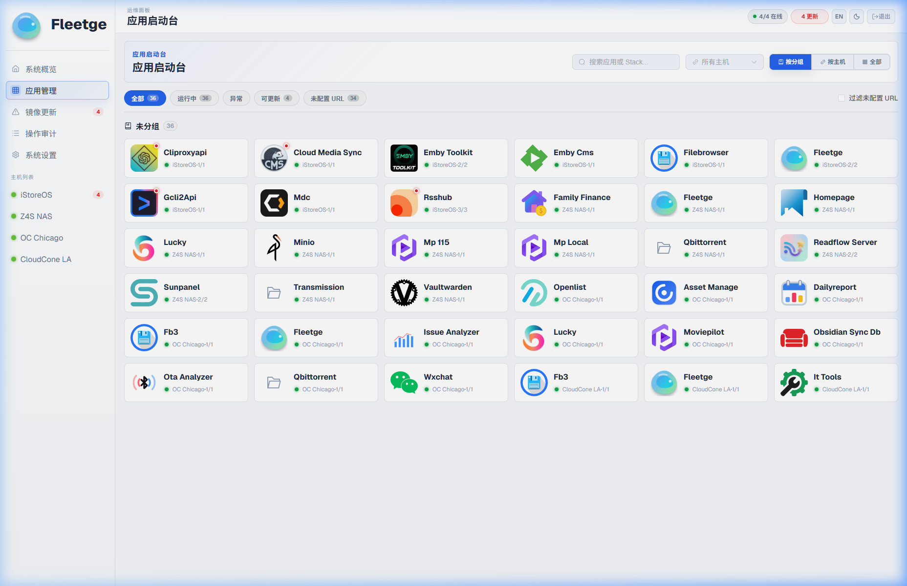
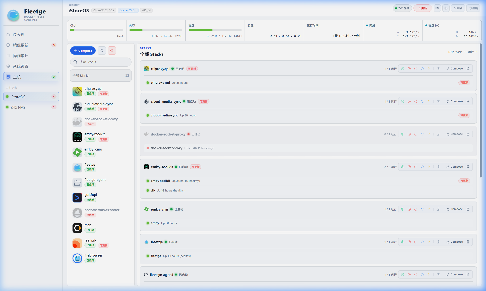
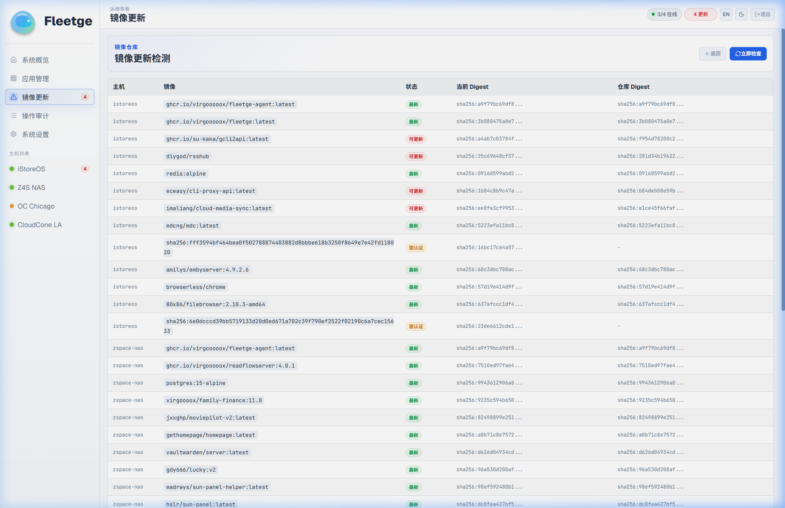
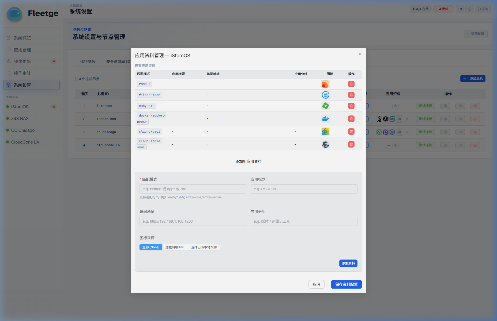
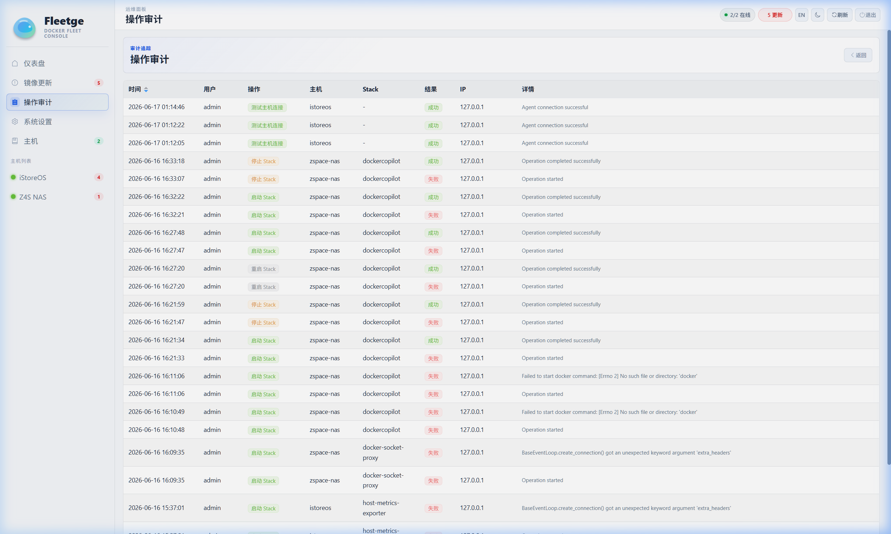
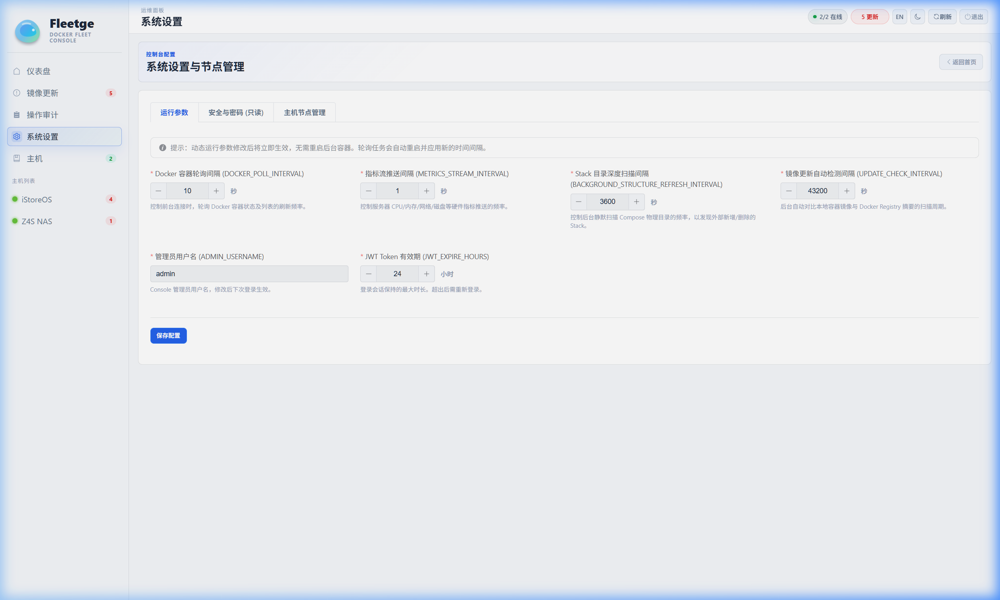

<div align="center">

#  Fleetge - Docker Fleet Console

**A lightweight, real-time multi-host Docker fleet and Compose Stack management console.**

**轻量级、实时的多主机 Docker 容器集群与 Compose Stack 统一运维大盘控制台。**

[简体中文](#-简体中文) | [English](#-english)

</div>

---

## 🇨🇳 简体中文

Fleetge 是一个专为多主机环境设计的轻量级 Docker 集群与 Compose 容器编排控制台。

它通过在被控节点部署极简的 `fleetge-agent`，将多个独立主机的容器运行状态、主机硬件指标（CPU、内存、磁盘、网络）及 Compose 编排生命周期整合在单一的现代化 Web 界面中。支持秒级实时性能曲线、日志流式输出，并且支持对所有敏感凭证进行高级加密，提供详细的操作审计日志。

### ✨ 核心特性

- **🔍 统一主机大盘监控**：实时在线探测与资源监控，展示 CPU、内存、磁盘 IO、网络流速及容器运行数等关键指标，支持秒级实时历史曲线。
- **🚀 统一应用启动台 (App Launchpad)**：聚合全集群的容器与应用。支持按分组、按主机归类展示，快速筛选运行状态或可更新项，并支持一键跳转到服务 Web 页面或管理后台，轻松化身为内网的优雅导航入口。
- **🔄 智能容器镜像更新检测**：后台自动对比本地容器镜像与 Registry 最新摘要，支持“最新、可更新、需认证、被限流、检查失败”等细分状态，支持在单机工作区一键批量更新所有有更新的 Stacks。
- **📦 主机系统升级检测**：自动检测 Agent 主机节点的操作系统软件包更新（如 apt/yum 更新），并在概览大盘与主机卡片上实时显示待更新数量。
- **⚙️ 节点管理与定制化增强**：支持集中编辑主机的 `global.env` 文件以统一注入 Compose 环境变量；支持基于 Wildcard 模式匹配自定义 Stack 图标；支持为应用配置自定义“应用资料”（标题、访问 URL、分组和上传本地图标）。
- **📦 Compose Stack 生命周期管理**：统一节点环境 Stack 列表，支持一键启动、停止、重启、更新与删除。提供容器的 SSE 实时终端输出，操作无缝流转。
- **➕ 可视化 Compose 编排编辑器**：提供直观易用的全新 Compose Stack 编写界面，支持语法高亮，轻松在线编排和部署容器。
- **🛡️ 凭证加固与操作审计**：所有连接凭证均采用 Fernet 高强度加密落库；管理员采用 Argon2 密码散列验证；所有关键写操作（清理、Stack 变更、系统配置）均记录在审计日志中，确保轨迹可追溯。
- **💡 极简接入**：在被控节点部署极简的 `fleetge-agent`，即可同时获得监控与 Compose 编排能力。

---

### 🖼️ UI 细节展示

#### 1. 全局主机监控大盘 (Overview Dashboard)
全局大盘提供了所有受管主机的实时在线状态与基础资源负载概览。可以一目了然地监控各主机的 CPU 使用率、内存占用、磁盘空间以及正在运行和已停止的容器数量，并支持一键检测所有主机的系统升级。

<div align="center">
  
</div>

#### 2. 统一应用启动台 (App Launchpad)
应用启动台整合了跨主机部署的所有 Web 服务和应用。您可以按自定义分组或主机节点聚合展示，并通过运行状态、待更新状态进行快速过滤，直接在此一键跳转到应用的外部链接或管理后台。

<div align="center">
  
</div>

#### 3. 主机控制台与实时监控 (Host Details & Live Monitor)
进入单台主机详情页后，系统将通过 Server-Sent Events (SSE) 协议为您推送**秒级更新**的 CPU 负载、内存占用、网络带宽流速以及磁盘 I/O 吞吐曲线。同时，您可以在此管理所有的 Docker Compose Stacks、查看实时容器终端日志、以及编辑 Compose 编排文件。

<div align="center">
  
</div>

#### 4. 镜像更新检测 (Image Updates Diagnostic)
集中管理所有主机的镜像更新情况。提供详尽的对比信息（当前本地 Digest vs 仓库最新 Digest），并细化展示“最新/可更新/需认证/被限流/检查失败”等状态，支持一键触发手动拉取检查。

<div align="center">
  
</div>

#### 5. 节点配置与定制管理 (Advanced Settings)
在主机节点管理中，您可以点击管理 Stack 的图标规则匹配映射，或在“应用资料”中定义容器应用的外网跳转 URL、显示名称、自定义分组并直接上传新图标。还可以一键编辑修改该节点的 `global.env` 全局环境变量。

<div align="center">
  
</div>

#### 6. 操作审计流水 (Audit Logs)
为了保障生产环境的操作安全性，Fleetge 内置了完善 of 审计机制。系统会自动记录用户登录、凭证修改、容器 Stack 的启动/停止/更新等关键指令的执行时间、操作用户和详细日志，随时应对安全回溯要求。

<div align="center">
  
</div>

#### 7. 安全与参数配置 (System Settings)
在系统设置页，您可以灵活调整运行参数（如轮询间隔、Session 过期时长等）并即时重载。所有输入的主机登录凭证均在后端数据库中经过强对称加密，页面上仅以脱敏形式展示。

<div align="center">
  
</div>

---

### 🚀 快速开始与部署

#### 1. 密钥准备
为了保障控制台的数据安全，在部署前您需要生成三组必要的密钥/哈希：

```bash
# A. 生成 JWT 签名密钥 (用于前端会话凭证)
python -c "import secrets; print(secrets.token_hex(32))"

# B. 生成 Fernet 强加密密钥 (用于加密落库的主机密码/Token)
python -c "from cryptography.fernet import Fernet; print(Fernet.generate_key().decode())"

# C. 设置管理员登录密码 (明文)
# 直接将密码填入 docker-compose.yml 即可。
```

#### 2. 编写配置文件
在项目根目录下创建并编辑 `docker-compose.yml`。

将上一步生成的密钥填入对应的环境变量中：

```yaml
version: '3.8'

services:
  fleetge:
    image: ghcr.io/virgooooox/fleetge:latest
    container_name: fleetge
    restart: unless-stopped
    ports:
      - "80:8000"
    environment:
      # 填入生成的密钥与哈希
      JWT_SECRET: "替换为步骤A生成的32位十六进制字符串"
      CREDENTIALS_KEY: "替换为步骤B生成的Fernet密钥"
      ADMIN_PASSWORD: "替换为您的强密码"
      
      # 配置文件与数据库路径
      DATABASE_URL: sqlite:////app/data/dashboard-local.db
      HOST_CONFIG_PATH: /app/data/hosts.yaml
      
      # 轮询时间配置 (秒)
      METRICS_STREAM_INTERVAL: 1  # SSE 指标前端推送间隔
      DOCKER_POLL_INTERVAL: 10     # 容器与 Stack 列表刷新间隔
      BACKGROUND_STRUCTURE_REFRESH_INTERVAL: 3600  # 无连接时后台轮询刷新间隔
      UPDATE_CHECK_INTERVAL: 43200 # 主机系统升级检测缓存时间
      
      LOG_LEVEL: info
    volumes:
      - ./data:/app/data
```

#### 3. 配置管理主机列表
初始化数据目录并创建主机配置文件：

```bash
mkdir -p data
cp hosts.yaml.example data/hosts.yaml
```

编辑 `data/hosts.yaml`，填入您的主机连接信息：

```yaml
hosts:
  - host_id: my-node-1
    display_name: "生产节点-01 (Agent模式)"
    sort_order: 1
    enabled: true
    agent:
      url: http://<your-agent-ip>:8080
      token: "your_agent_secret_token"
```

#### 4. 启动控制台
```bash
docker compose up -d
```
启动后在浏览器中访问 `http://<your-server-ip>`，使用管理员用户名（默认 `admin`）和配置好的密码登录即可。

---

### 🔌 受管主机部署 (Fleetge Agent)

对于希望一键接入并同时支持指标监控与 Compose Stack 编排的远程主机，推荐部署轻量级的 `fleetge-agent`：

在被控节点创建 `docker-compose.yml` 并启动：

```yaml
version: '3.8'

services:
  agent:
    image: ghcr.io/virgooooox/fleetge-agent:latest
    container_name: fleetge-agent
    restart: unless-stopped
    ports:
      - "8080:8080"
    environment:
      - AGENT_TOKEN=your_agent_secret_token  # 对应主控端 hosts.yaml 中的 token
      - STACKS_BASE_DIR=/opt/stacks          # Docker Compose 文件在宿主机的存放目录
      - DISK_PATHS=/                         # 监控的宿主机挂载点，多个用逗号分隔
      - COLLECT_INTERVAL=5                   # 指标采集频率 (秒)
    volumes:
      - /var/run/docker.sock:/var/run/docker.sock
      - /opt/stacks:/opt/stacks
```
运行启动指令：
```bash
docker compose up -d
```

---
---

## 🇺🇸 English

Fleetge is a lightweight, real-time Docker fleet and Compose Stack management console designed for multi-host server environments.

By aggregating data from `fleetge-agent`, Fleetge provides a unified, production-ready interface to inspect container statuses, monitor hardware performance (CPU, Memory, Disk, Network) with 1-second interval charts, deploy Compose stacks, and review secure audit logs.

### ✨ Core Features

- **🔍 Unified Fleet Dashboard**: Multi-host status overview showing CPU, memory, disk, network throughput, and container count.
- **🚀 Unified App Launchpad**: Aggregate all compose stack services across the fleet into an unified portal. Group apps by host or category, filter by running/outdated status, and quickly access applications or operations with elegant action layouts.
- **🔄 Container Image Update Detection**: Real-time comparison of local container images against remote registries. Supports checking update status (Up-to-date, Updatable, Needs Auth, Rate Limited, Check Failed) and triggering one-click batch updates for stacks.
- **📦 Host OS Update Checking**: Agent-level monitoring of host package updates (apt/yum) with visual badges on the central dashboard and host lists.
- **⚙️ Advanced Host Configuration**: Support for global environment variables (`global.env`) injection, custom Stack icons using wildcard patterns, and customized App Profiles (titles, custom group names, custom-uploaded icon assets, and external link endpoints).
- **📦 Stack Lifecycle Control**: Start, stop, restart, update, and remove Compose Stacks remotely, complete with a live terminal output powered by Server-Sent Events (SSE).
- **➕ Built-in Compose Editor**: Write, edit, and orchestrate Compose files directly inside a syntax-highlighted editor.
- **🛡️ Secure Access & Auditing**: Enterprise-grade Fernet encryption for remote tokens and passwords; secure Argon2 hashing for administrator logins; comprehensive audit logging for all critical state actions.
- **💡 Flexible Agent Options**: Run a tiny helper agent (`fleetge-agent`) on remote hosts to fetch host-level metrics and execute Compose commands.

---

### 🖼️ UI Showcase

#### 1. Overview Dashboard
Get a high-level picture of your entire host fleet. Real-time metrics widgets display CPU, RAM, disk space, and total containers running/stopped across all connected servers. A central update utility checks if any remote host requires system package updates.

<div align="center">
  
</div>

#### 2. App Launchpad
The App Launchpad consolidates all web services and containers deployed across different hosts into a single portal. You can group apps by customized categories or hosts, filter by status, and launch, stop, or navigate to their web pages directly.

<div align="center">
  
</div>

#### 3. Host Operations & Metrics Stream
Inside each host's workspace, view **1-second real-time charts** streaming CPU usage, memory foot-print, disk IO, and network speeds. Launch, restart, or update stacks on this host, edit compose configurations, or look at container terminals in real-time.

<div align="center">
  
</div>

#### 4. Image Update Tracking
A diagnostic center to track updates for all container images. It details the exact mismatch of local vs. registry digests, categorizes registry status (up-to-date, updatable, needs authentication, rate-limited, check failed), and allows manually forcing a registry sweep.

<div align="center">
  
</div>

#### 5. Settings & Advanced Customization
In host settings, you can define Stack matching icons, customize App Profiles (titles, custom group names, custom-uploaded icon assets, and external link endpoints), and edit host-wide `global.env` files to inject shared Compose variables.

<div align="center">
  
</div>

#### 6. Audit Logs Trail
Track all administrative and cluster events. Whenever a user logs in, triggers a stack action, or alters credentials, it is permanently logged with the timestamp, target host, operator account, and log payload.

<div align="center">
  
</div>

#### 7. Settings & Credentials Manager
Easily register new hosts, assign weights, sort order, and manage console running params. Fleetge securely encrypts credentials in your local SQLite/PostgreSQL database, ensuring that raw passwords and tokens are never exposed.

<div align="center">
  
</div>

---

### 🚀 Quick Start & Deployment

#### 1. Generate Security Credentials
To configure the environment securely, generate the required security keys:

```bash
# A. Generate a JWT Secret (for web session verification)
python -c "import secrets; print(secrets.token_hex(32))"

# B. Generate a Fernet Key (for database credentials encryption)
python -c "from cryptography.fernet import Fernet; print(Fernet.generate_key().decode())"

# C. Set the plain-text administrator login password.
# Simply fill the password in docker-compose.yml.
```

#### 2. Create the Compose Config
Create a `docker-compose.yml` file in your project directory:

```yaml
version: '3.8'

services:
  fleetge:
    image: ghcr.io/virgooooox/fleetge:latest
    container_name: fleetge
    restart: unless-stopped
    ports:
      - "80:8000"
    environment:
      # Inject your generated secrets
      JWT_SECRET: "replace_with_jwt_secret_from_step_A"
      CREDENTIALS_KEY: "replace_with_fernet_key_from_step_B"
      ADMIN_PASSWORD: "replace_with_your_strong_password"
      
      # Database and configurations
      DATABASE_URL: sqlite:////app/data/dashboard-local.db
      HOST_CONFIG_PATH: /app/data/hosts.yaml
      
      # Metrics and structure polling intervals (in seconds)
      METRICS_STREAM_INTERVAL: 1  # Frequency of SSE metrics pushes to clients
      DOCKER_POLL_INTERVAL: 10     # Refresh interval for containers/stacks with active web UI
      BACKGROUND_STRUCTURE_REFRESH_INTERVAL: 3600  # Offline refresh interval
      UPDATE_CHECK_INTERVAL: 43200 # System update check cache TTL
      
      LOG_LEVEL: info
    volumes:
      - ./data:/app/data
```

#### 3. Configure Hosts List
Initialize the configuration volume:

```bash
mkdir data
cp hosts.yaml.example data/hosts.yaml
```

Edit `data/hosts.yaml` to specify the managed nodes:

```yaml
hosts:
  - host_id: my-node-1
    display_name: "Production Node 01 (Agent)"
    sort_order: 1
    enabled: true
    agent:
      url: http://<your-agent-ip>:8080
      token: "your_agent_secret_token"
```

#### 4. Run the Console
Start the service:
```bash
docker compose up -d
```
Access the console at `http://localhost:80` (or your server's IP address) and log in using the administrator username (default `admin`) and the password configured in `ADMIN_PASSWORD`.

---

### 🔌 Agent Setup (Fleetge Agent)

To connect remote hosts securely and monitor system metrics along with Docker Compose stacks, deploy the lightweight agent on each target node:

```yaml
version: '3.8'

services:
  agent:
    image: ghcr.io/virgooooox/fleetge-agent:latest
    container_name: fleetge-agent
    restart: unless-stopped
    ports:
      - "8080:8080"
    environment:
      - AGENT_TOKEN=your_agent_secret_token  # Must match the token configured in hosts.yaml
      - STACKS_BASE_DIR=/opt/stacks          # The host path where Compose stacks are located
      - DISK_PATHS=/                         # Mount points to monitor (comma separated)
      - COLLECT_INTERVAL=5                   # Metric polling interval in seconds
    volumes:
      - /var/run/docker.sock:/var/run/docker.sock
      - /opt/stacks:/opt/stacks
```
Start the agent:
```bash
docker compose up -d
```

---

## 🛠️ Environment Configuration Reference / 环境变量参考

The dashboard console supports the following environment variables:

| Variable / 环境变量 | Type / 类型 | Default / 默认值 | Description / 描述 |
| :--- | :--- | :--- | :--- |
| `JWT_SECRET` | String | *Required / 必填* | Hex signature key for JSON Web Tokens. / 用于 JWT 鉴权的 64 位十六进制签名密钥。 |
| `CREDENTIALS_KEY` | String | *Required / 必填* | Fernet symmetric key to encrypt remote passwords/tokens in the DB. / 数据库敏感凭证的 Fernet 对称加密密钥。 |
| `ADMIN_USERNAME` | String | `admin` | Custom administrator username. / 自定义管理员用户名，修改后下次登录生效。 |
| `ADMIN_PASSWORD`      | String | *Required / 必填* | Plain-text administrator login password. / 管理员登录密码的明文。 |
| `DATABASE_URL` | String | `sqlite:////app/data/dashboard-local.db` | Connection URI for SQLAlchemy. / 数据库连接 URI，支持 SQLite/PostgreSQL 等。 |
| `HOST_CONFIG_PATH` | String | `/app/data/hosts.yaml` | Host YAML file path. / 主机静态配置文件路径。 |
| `METRICS_STREAM_INTERVAL` | Integer | `1` | Stream update interval for metrics in seconds. / SSE 实时性能指标推送间隔（秒）。 |
| `DOCKER_POLL_INTERVAL`| Integer | `10` | Poll interval for Docker containers/stacks. / 前端在线时，Docker 容器结构轮询刷新间隔（秒）。 |
| `BACKGROUND_STRUCTURE_REFRESH_INTERVAL`| Integer | `3600` | Offline background poll interval. / 前端离线时，后台轮询刷新数据结构间隔（秒）。 |
| `UPDATE_CHECK_INTERVAL`| Integer | `43200` | Host update check cache time. / 主机系统与容器镜像升级检测缓存时间（秒，默认12小时）。 |
| `JWT_EXPIRE_HOURS` | Integer | `24` | Expiry duration for JSON Web Tokens in hours. / 登录会话 Token 的有效期时长（小时）。 |
| `CORS_ORIGINS` | String | *Empty / 留空* | Allowed CORS origins, comma separated. / 跨域允许来源列表，逗号分隔，留空为同源。 |
| `LOG_LEVEL` | String | `info` | Logging level (`debug`, `info`, `warning`, `error`). / 控制台日志级别。 |

---
Released under the [MIT License](LICENSE).
